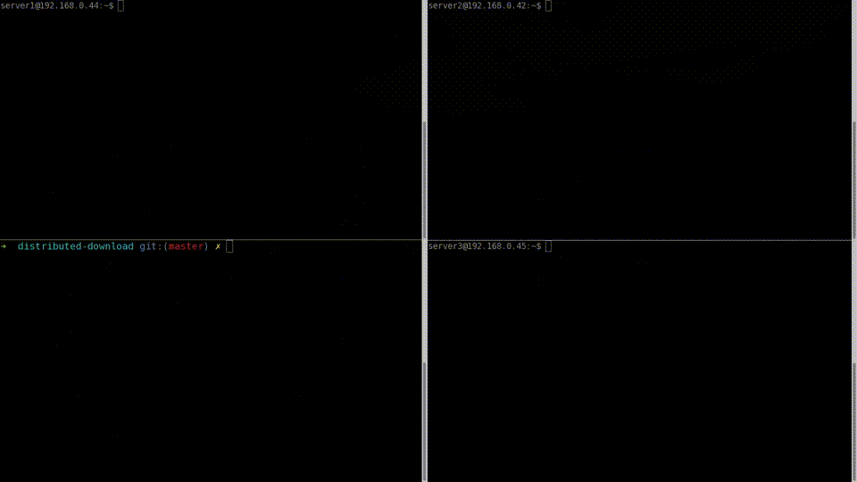

# Distributed Download
Bypass bandwidth restrictions by segmenting file transfers



## Motivation
Suppose a group of people wish to share a large file between themselves. Rather than having one source send the same file multiple times, the following idea can be implemented to lighten the load and achieve faster cumulative download time.

## The Idea
<p> Let k be the number of clients connected and let n be the size of the file being transferred. The server begins by partitioning the file into k partitions of n/k bytes each (last partition slightly larger if k is not a factor of n). It then sends the ith partition to the ith client. Once every client has received their partition, each client then simultaneously sends its partition to the rest of its peers, such that upon completion, every client has the file in its entirety. </p>

## To Build 
 
 Simply clone this repository and use the Makefile to build
 
 ```git clone https://github.com/tazzaoui/distributed-download.git && cd distributed-download && make```
 
 You'll end up with two executables, namely ```server``` and ```client```
 
## To Run
First run the server using the ```server ``` executable. The default listening port is 4444 but the -p flag can be used to specify a different port. Make sure your firewall's rules don't conflict with the server's configuration. 

<b>Required</b>: Use the -n and -f flags to specify the number of clients to accept and the file to transfer respectively.

e.g. ```server@208.118.235.174:~ $ ./server -n 3 -f V_For_Vendetta.mp4```
 
Then connect each client by invoking the ```client``` executable. The -i and -p flags can be used to specify the server's IP address and port number respectively. Note that the client will connect to port 4444 by default, but should be configured to match the server.

e.g. ```client1@192.168.0.45:~ $ ./client -i 208.118.235.174```
